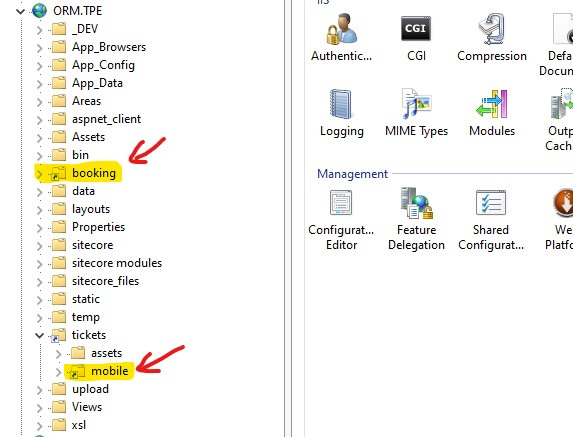

# BookingFlow Project

This project was generated with [angular-cli](https://github.com/angular/angular-cli) version 1.0.0-beta.15.

## Technical stack and dependencies
- Angular v2.4.7
- NPM v3.10.8
- NodeJS v6.9.1
- TypeScript v2.2.2
- RxJS v5.0.0 => Reactive programming library
- Bower v1.8.8

## Setup

1.  Clone the repository
2.  Ensure that the custom `TOC-Icon` components can be served from an internal CI server or module repository. This could be done either by setting up a private module repository, or by copying the required module to a local folder. Once done open `bower.json` file and update the url for the `toc-icon` module
3.  Run `npm install` from the command line in the root repository folder

## Development server
Run `npm run start` for a dev server. Navigate to `http://localhost:4200/`. The app will automatically reload if you change any of the source files. Running the application using the development server is recommended when working on the project in isolation. To test the end-2-end handover functionality between other projects (brochure site, MixingDeck, MyAccount) the project needs to be built in production mode and it needs to be hosted in IIS.

## Production Build

Run `npm run build -- --basepath /tickets/mobile/` to build the project in production mode. The build artifacts will be stored in the `dist/` directory.

## IIS setup with integration to other applications
1. Open the TPE brochure site application in IIS
2. Create new virtual directory called `booking` and point it to the `dist/` directory where the production build output is stored.
3. Open the `tickets` virtual directory which was created when setting up the MixingDeck project for integrated mode.
4. Inside the `tickets` virtual directory create an other virtual directory called `mobile` and point this one to the `dist/` directory too, where the production build output is stored.

After completing the above steps, the brochure site application in IIS should look as on the screenshot below.

## External services and dependencies
- Google Recaptcha: SiteKey is stored in `src/config.env.json` file under `recaptchaSiteKey` property
- Google Tag Manager: Continer ID is stored in `src/config.env.json` file under `tagManagerContainer` property
- ORM RetailHub API: Api endpoint it stored in `src/config.env.json` under `defaultApiBaseUrl` property
- TPE Sitecore brochure site API: Api endpoint it stored in `src/config.env.json` under `defaultSitecoreApiUrl` property

## Running unit tests - not used

Run `ng test` to execute the unit tests via [Karma](https://karma-runner.github.io).

## Running end-to-end tests - not used

Run `ng e2e` to execute the end-to-end tests via [Protractor](http://www.protractortest.org/).
Before running the tests make sure you are serving the app via `ng serve`.